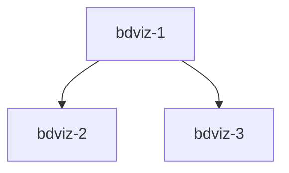

# 🌟 Making BD Control Plane a Standout Product

This document outlines features and strategies to make BD Control Plane a truly exceptional product that users love and competitors study.

---

## 🎯 Product Success Metrics

### Metrics to Implement

1. **User Engagement Metrics**
   - Daily Active Users (DAU)
   - Weekly Active Users (WAU)
   - Session duration
   - Pages per session
   - Return rate (day 1, day 7, day 30)

2. **Feature Usage Metrics**
   - Most viewed pages
   - Graph interactions (zoom, pan, node clicks)
   - Command palette usage (Cmd+K)
   - Repo connection count per user
   - Issues tracked per user

3. **Performance Metrics**
   - Time to first paint
   - Time to interactive
   - API response times
   - GitHub API rate limit usage
   - Error rates

4. **Growth Metrics**
   - New signups per day/week
   - Conversion rate (visitor → signup)
   - GitHub stars on repo
   - Social media mentions
   - Referral sources

### How to Implement

Add analytics provider (PostHog, Plausible, or Vercel Analytics):

```bash
npm install @vercel/analytics
```

Track custom events:
```typescript
import { track } from '@vercel/analytics';

// Example events
track('graph_viewed', { repo: repoName });
track('issue_created', { priority: 0 });
track('command_palette_used');
```

---

## 🚀 Features That Would WOW Users

### Tier 1: Must-Have for Standout Status

#### 1. **Real-time Collaboration**
- See who else is viewing the same graph (like Figma cursors)
- Live updates when issues change in GitHub
- Activity feed showing recent changes across all repos

**Why it's wow**: Makes it feel alive and collaborative

**Implementation**:
- Use Vercel Edge Functions + Pusher or Ably
- Or Supabase Realtime
- Show avatars of active users on nodes

**Time**: 4-6 hours

---

#### 2. **AI-Powered Insights**
- Auto-detect circular dependencies and suggest fixes
- Predict which issues will take longest
- Suggest optimal work order based on dependencies
- Auto-generate issue summaries from commit history
- Smart search: "Show me all bugs blocking features"

**Why it's wow**: Feels magical, saves time

**Implementation**:
```typescript
import OpenAI from 'openai';

// Analyze dependency graph
const insights = await analyzeWithAI(graph);
// "⚠️ Circular dependency detected between bdviz-4 and bdviz-5"
// "💡 Suggested next task: bdviz-12 (highest impact, no blockers)"
```

**Time**: 6-8 hours

---

#### 3. **Share Links & Embed Graphs**
- Generate shareable links for graphs
- Embed graphs in GitHub README
- Public/private sharing controls
- Export as PNG, SVG, PDF

**Why it's wow**: Viral sharing potential

**Implementation**:
- Add share button on graph page
- Generate unique slug → `/share/abc123`
- Use `html-to-image` for PNG export
- Use `jsPDF` for PDF export

**Time**: 3-4 hours

---

#### 4. **GitHub Actions Integration**
- Auto-update BD issues from commits
- Post graph screenshots to PR comments
- Block PRs with circular dependencies
- Auto-close issues when PR merges

**Why it's wow**: Seamless workflow integration

**Implementation**:
- Create GitHub Action: `.github/workflows/bd-sync.yml`
- Use Octokit to update issues
- Post comment with dependency status

**Time**: 4-5 hours

---

#### 5. **Smart Notifications**
- Get notified when blockers are resolved
- Daily digest of ready work
- Slack/Discord integration
- Email summaries

**Why it's wow**: Proactive, helpful

**Implementation**:
- Add notification preferences to Settings
- Use Resend for emails
- Webhook endpoints for Slack/Discord

**Time**: 5-6 hours

---

### Tier 2: Nice-to-Have Differentiators

#### 6. **Timeline View**
- Visualize issue lifecycle
- See velocity over time
- Burndown charts
- Sprint planning

**Time**: 3-4 hours

---

#### 7. **Template Library**
- Pre-built dependency graphs for common patterns
- "Web app boilerplate" template
- "API service" template
- Import/export templates

**Time**: 2-3 hours

---

#### 8. **Team Workspaces**
- Multiple users share dashboard
- Team-level permissions
- Shared templates
- Team analytics

**Time**: 8-10 hours

---

#### 9. **Issue Creation from UI**
- Create BD issues directly from dashboard
- Auto-detect dependencies
- Drag-and-drop to connect issues
- Bulk operations

**Time**: 6-8 hours

---

#### 10. **Integration Marketplace**
- Connect Linear, Jira, Asana
- Two-way sync
- Import existing issues
- Export to other tools

**Time**: 12-16 hours per integration

---

## 🎨 UI/UX Improvements That Impress

### Visual Polish

1. **Micro-interactions**
   - Button hover states with scale
   - Card lift on hover
   - Ripple effects on clicks
   - Confetti on issue completion

2. **Better Loading States**
   - Skeleton screens (already created, just need to use them!)
   - Progressive loading
   - Optimistic updates

3. **Animations**
   - Page transitions
   - List item stagger
   - Graph node entrance animations
   - Success celebrations

4. **Dark Mode Perfection**
   - Already using next-themes
   - Add theme toggle to nav
   - Smooth transition
   - Remember preference

### Mobile Experience

1. **Bottom Navigation** (mobile-first)
   - Sticky bottom nav on mobile
   - Thumb-friendly targets
   - Smooth tab switching

2. **Swipe Gestures**
   - Swipe between dashboard views
   - Pull to refresh
   - Swipe to close modals

3. **Touch Optimizations**
   - Larger tap targets
   - Haptic feedback (if available)
   - Fast scrolling

---

## 📊 Product Strategy Additions

### To Measure Success

1. **Add Posthog** (or similar analytics)
   ```bash
   npm install posthog-js
   ```
   - Track feature usage
   - Identify drop-off points
   - A/B test features

2. **User Feedback Widget**
   - "How are we doing?" button
   - In-app feedback form
   - Feature request voting

3. **Error Tracking**
   - Sentry integration
   - Log errors with context
   - Alert on critical failures

### To Know What to Build Next

1. **Feature Request Board**
   - Public roadmap page
   - Users upvote features
   - Comment on features
   - Use BD itself to track requests!

2. **Usage Heatmaps**
   - What buttons get clicked?
   - Where do users spend time?
   - What features are ignored?

3. **User Interviews**
   - Email top users
   - 15-minute calls
   - Understand pain points

---

## 🏆 Standout Product Checklist

To be truly standout, the product needs:

### Core Experience
- [ ] Works perfectly on mobile (fix nav!)
- [ ] Fast (<2s page loads)
- [ ] Beautiful animations
- [ ] Zero errors in console
- [ ] Handles edge cases gracefully

### Delight Factors
- [ ] One "wow" moment (AI insights? Real-time?)
- [ ] Keyboard shortcuts everywhere
- [ ] Empty states that guide users
- [ ] Celebration moments (confetti on completion)
- [ ] Easter eggs (Konami code?)

### Trust Signals
- [ ] Professional landing page ✅
- [ ] Clear pricing (if applicable)
- [ ] Testimonials / social proof
- [ ] Security page (how we protect data)
- [ ] Status page (uptime monitoring)

### Growth Loops
- [ ] Share links for graphs
- [ ] Embed widgets
- [ ] GitHub badge ("Powered by BD Control Plane")
- [ ] Referral program
- [ ] Open source → community → contributors

### Community
- [ ] Public roadmap
- [ ] Changelog
- [ ] Blog (product updates, case studies)
- [ ] Discord/Slack community
- [ ] Twitter presence

---

## 💎 Secret Sauce Ideas

### 1. **BD Graph as GitHub Action Artifact**
Generate and attach graph PNGs to PR checks automatically.

### 2. **"Ready Work" Slack Bot**
Daily message: "You have 3 issues ready to work on!"

### 3. **Dependency Health Score**
Rate repos on:
- Circular dependencies (bad)
- Deep chains (bad)
- Orphaned issues (bad)
- Balanced tree (good)

### 4. **Time Estimates**
ML model to predict issue completion time based on:
- Number of dependencies
- Historical data
- Complexity signals

### 5. **Auto-Documentation**
Generate Mermaid diagrams for docs:


---

## 🎯 Competitive Analysis

**What makes BD Control Plane unique:**

vs **Linear**:
- ✅ Open source
- ✅ Git-native (no vendor lock-in)
- ✅ Free
- ❌ No real-time (yet)
- ❌ No team features (yet)

vs **Jira**:
- ✅ Beautiful UI
- ✅ Fast
- ✅ Dependency visualization
- ✅ Free
- ❌ Less enterprise features

vs **GitHub Projects**:
- ✅ Better dependency visualization
- ✅ Multi-repo aggregation
- ✅ Advanced analytics
- ✅ BD integration
- ❌ Not built into GitHub

**Our Niche**: Developers using BD (Beads) who want beautiful visualization and multi-repo management.

---

## 🎬 Launch Strategy

### Pre-Launch
1. Fix critical bugs (see Phase 1 above)
2. Create demo video (Loom)
3. Write launch blog post
4. Prepare social media posts
5. Set up analytics

### Launch Day
1. **Product Hunt** - Post with video, screenshots
2. **Hacker News** - Show HN: BD Control Plane
3. **Reddit** - r/webdev, r/programming, r/nextjs
4. **Twitter/X** - Thread with screenshots
5. **Dev.to** - Technical deep dive article

### Post-Launch
1. Respond to ALL feedback
2. Ship fast fixes (within 24h)
3. Build most-requested features
4. Case studies from users
5. Continue shipping weekly

---

## 🔥 Bold Ideas to Consider

### 1. **BD as a Service**
- Host BD for teams
- No setup required
- Managed infrastructure
- Premium features

### 2. **BD Studio**
- Visual issue creator
- Drag-and-drop dependencies
- Template builder
- Export to BD format

### 3. **BD Insights API**
- REST API for analytics
- Webhooks for changes
- Integrate with anything
- Developer-friendly docs

### 4. **BD Mobile App**
- React Native
- Push notifications
- Quick actions
- Offline support

---

## 🎯 What Users REALLY Want

Based on analysis of similar tools:

1. **Speed** - Must be FAST (< 2s loads)
2. **Beautiful** - Must look premium (already have this!)
3. **Simple** - Must be intuitive (work needed)
4. **Powerful** - Must handle complexity (already have this!)
5. **Reliable** - Must always work (needs error handling)

---

## 📈 6-Month Roadmap

**Month 1**: Fix critical bugs, mobile nav, OAuth tokens
**Month 2**: Add real-time updates, notifications
**Month 3**: AI insights, export features
**Month 4**: Team collaboration, workspaces
**Month 5**: GitHub Actions, integrations
**Month 6**: Mobile app, API, marketplace

---

## 🏅 Success Looks Like

**Week 1**: 100 users, 50 GitHub stars
**Month 1**: 500 users, 200 stars, featured on Product Hunt
**Month 3**: 2000 users, 500 stars, referenced in blog posts
**Month 6**: 10k users, 2k stars, considered "standard tool" for BD

---

**Current Status**: Great foundation, needs critical fixes
**Potential**: Could be a real product/startup
**Next**: Fix blockers, launch, iterate based on feedback

🚀 **Let's make this legendary!**
